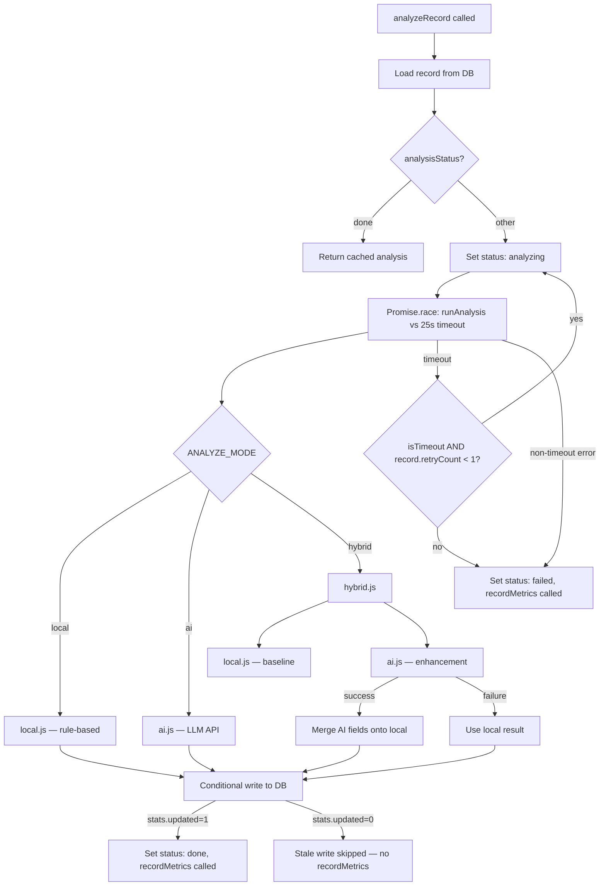

# Analyzer Architecture

## 1. Overview

The `analyze` cloud function uses a **pluggable analyzer** pattern. The active
analyzer is selected at cold-start via the `ANALYZE_MODE` environment variable
(WeChat cloud console → cloud function config). No code changes are needed to
switch modes.

### ANALYZE_MODE dispatcher

| Value | Analyzer | When to use |
|-------|----------|-------------|
| `local` | Rule-based only | Default / no AI key configured |
| `ai` | LLM API only | Testing AI in isolation |
| `hybrid` | Local baseline + AI overlay | **Recommended for production** |

Unknown values are rejected at cold-start with a hard error to prevent silent
misconfiguration.

### Responsibilities

- **local** — pure, synchronous, always available. Derives analysis from a
  rule table keyed by `(ageRange, category)`. Never fails.
- **ai** — calls an external LLM API (OpenAI-compatible or Anthropic). Handles
  its own retries with exponential backoff. Throws a typed `AiError` on
  unrecoverable failure.
- **hybrid** — runs `local` first for a guaranteed baseline, then attempts
  `ai` for richer output. On any AI failure (immediate for non-retryable,
  after retry exhaustion for retryable) falls back to the local result.

### Backward compatibility

The flat `analysis` object written to the DB is never restructured. Only the
caller-visible `data` payload returned to the mini-program changes shape (see
`runAnalysis` in `index.js`). Old records remain fully readable.

---

## 2. Module Structure

```
cloud/analyze/
├── index.js                  # Cloud function entry, lifecycle, metrics
├── analyzers/
│   ├── local.js              # Rule-based analyzer
│   ├── ai.js                 # LLM API analyzer (production-grade)
│   └── hybrid.js             # Orchestrator: local + AI with fallback
└── lib/
    └── psychology.js         # Rule table + analysis helpers
```

### `index.js` — dispatcher + lifecycle

- Validates `ANALYZE_MODE` at module load; throws on unknown value.
- Selects and requires `./analyzers/${ANALYZE_MODE}` once.
- `analyzeRecord(recordId)` manages status: `(any status except 'done') → analyzing → done | failed`.
  Only `done` short-circuits (returns cached result). Records with status `failed`,
  `analyzing`, or `pending` all proceed to reanalysis.
- Wraps `runAnalysis()` in a 25 s `Promise.race` timeout with 1 retry on
  timeout.
- Conditional write (`where({ _id, analysisStatus: 'analyzing' }).update(...)`)
  prevents stale overwrites under concurrent invocations.
- `recordMetrics()` writes to `analyze_metrics/global` with atomic `_.inc()`;
  upsert strategy handles the first-write race between concurrent invocations.
- `checkMetricsInvariant()` runs when `METRICS_INVARIANT_CHECK=true`, OR when
  `NODE_ENV` is **set** and not `'production'`. If `NODE_ENV` is unset (typical
  in WeChat cloud), only the explicit flag triggers it. Never throws.

### `analyzers/local.js` — rule-based analyzer

**Contract:** `analyze(record) → { analysis, source: 'local' }`

- Pure computation — no network, no DB.
- Delegates to `analyzeBehavior(behavior, category, ageInMonths)` and
  `getDevelopmentAdvice(category)` from `lib/psychology.js`.
- Confidence level derived from rule importance:
  `critical → high`, `important → medium`, `normal → low`.
- Always returns a valid result; never throws.

### `analyzers/ai.js` — LLM analyzer

**Contract:** `analyze(record) → { analysis, source: 'ai' }` or throws `AiError`

**Configuration** (WeChat cloud console env vars):

| Var | Default | Description |
|-----|---------|-------------|
| `AI_API_KEY` | — | Required |
| `AI_API_ENDPOINT` | — | Required (full URL) |
| `AI_MODEL` | `gpt-4o` / `claude-sonnet-4-20250514` | Optional |
| `AI_API_FORMAT` | auto-detected | `openai` or `anthropic` |
| `AI_TIMEOUT_MS` | `15000` | Per-attempt hard timeout |
| `AI_MAX_RETRIES` | `2` | Max retry attempts on retryable errors |

**Format detection:** `AI_API_FORMAT` env takes precedence; otherwise
`anthropic` if endpoint URL contains `anthropic.com`, else `openai`.

**Error types and retryability:**

| Type | Retryable | Cause |
|------|-----------|-------|
| `timeout` | yes | `AbortController` fired after `AI_TIMEOUT_MS` |
| `network` | yes | `fetch` threw (DNS, TCP, TLS) |
| `api_5xx` | yes | HTTP 5xx from the API provider |
| `api_4xx` | no | HTTP 4xx (bad key, quota, invalid request) |
| `parse` | no | Response is not valid JSON |
| `schema` | no | Required fields absent, or missing config |

**Retry loop:** `attempt = 0..AI_MAX_RETRIES`. Breaks immediately on
non-retryable errors. Backoff: `500ms * 2^attempt + rand(0, 200)ms`.

**Internal metrics** (module-level singleton, exported as `_metrics`):
`ai_calls`, `ai_success`, `ai_timeout`, `ai_error`, `ai_retry`, `ai_fallback`.
All logged to console via `[ai:metrics]` prefix — no DB writes.

### `analyzers/hybrid.js` — orchestrator

**Contract:** `analyze(record) → { analysis, source: 'hybrid' | 'local' }`

- Runs `local.js` synchronously first (guaranteed baseline).
- Awaits `ai.js`; on success, overlays three AI fields onto the local result:
  `psychologicalInterpretation`, `emotionalInterpretation`,
  `parentingSuggestions` (only where non-null).
- On any AI error, returns the unmodified local result with `source: 'local'`.
- Does **not** duplicate retry logic — `ai.js` owns all retries internally.
- Increments `aiAnalyzer._metrics.ai_fallback` on each fallback event.

---

## 3. Execution Flow



---

## 4. Analysis Output Schema

All analyzers return an `analysis` object with this flat shape (stored as JSON
string in `records.analysis`):

```js
{
  developmentStage:          string,   // e.g. "前运算阶段"
  psychologicalInterpretation: string, // ~200 chars, theory-referenced
  emotionalInterpretation:   string | null,
  parentingSuggestions: [
    {
      type:           'observe' | 'emotional' | 'guidance' | 'none',
      content:        string,
      theoryReference: string | null,
      deepInsight:    string | null,
    }
  ],
  milestone:       string | null,
  confidenceLevel: 'high' | 'medium' | 'low',
  source:          'local' | 'ai' | 'hybrid',
}
```

`local.js` leaves `emotionalInterpretation`, `theoryReference`, and
`deepInsight` as `null`. `ai.js` / `hybrid.js` populate them when available.

---

## 5. Adding a New Analyzer

1. Create `analyzers/<name>.js` implementing the contract:
   ```js
   async function analyze(record) {
     // ...
     return { analysis: { /* flat schema */ }, source: '<name>' }
   }
   module.exports = { analyze }
   ```
2. Add `'<name>'` to `VALID_ANALYZE_MODES` in `index.js`.
3. Deploy. Set `ANALYZE_MODE=<name>` in the cloud function env config.

No other files need to change.

---

## 6. Environment Variables Reference

| Variable | Required | Default | Description |
|----------|----------|---------|-------------|
| `ANALYZE_MODE` | no | `local` | `local` / `ai` / `hybrid` |
| `AI_API_KEY` | if ai/hybrid | — | API key |
| `AI_API_ENDPOINT` | if ai/hybrid | — | Full API URL |
| `AI_MODEL` | no | format-dependent | Model name |
| `AI_API_FORMAT` | no | auto | `openai` or `anthropic` |
| `AI_TIMEOUT_MS` | no | `15000` | Per-attempt timeout (ms) |
| `AI_MAX_RETRIES` | no | `2` | Max retries on retryable errors |
| `METRICS_INVARIANT_CHECK` | no | — | Set `true` to enable dev checks |
