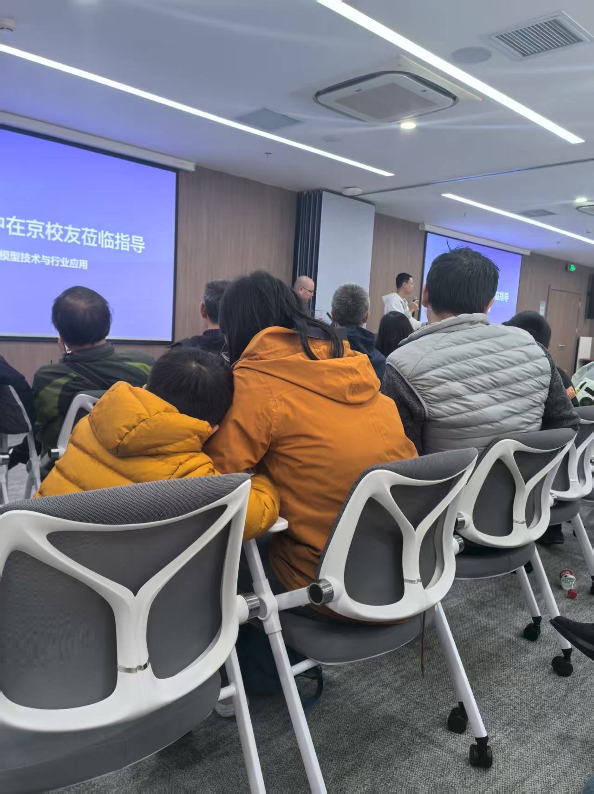

# 我可怜的老母亲

时间：2025-12-30 14:54 周二,乙巳蛇年十一月十一

地点：未知
天气：--


 标签: `沐歌` `父母` 


可怜的老母亲，一年来不知道受了多少气。
我训她的，细涛训她的，沐歌气她的。
昨天九点回家，她在看视频，沐歌在上课，后来我陪沐歌学习一直到睡觉，都没感觉到家里有啥异常。
直到第二天早上起床才听老妈说她一晚没睡，诧异，咋又失眠了，后来听她说话有点怒气，带着疑惑去上班了。早晨抽空给她打电话，老妈说细涛昨晚因为沐歌下围棋的事情，跟她拍桌子了，说着都掉眼泪了。
唉，真是可怜天下父母心，老妈背井离乡，北漂着，忍辱负重的照顾沐歌，有苦都没地方说去，心里是对沐歌的全部牵挂，深陷泥潭却不得抽身放手。


---

# 双线学习之爬虫

时间：2025-07-24 12:23 周四,乙巳蛇年六月卅十

地点：未知
天气：--


目标拆解

    最终目标是：
    ✅ 能够通过断点调试 + 控制台 + 调用栈
    ✅ 准确定位 JS 中的加密逻辑入口，包括 AES、MD5、混淆函数、签名函数等
    ✅ 并能配合复写、hook、还原源码完成还原或模拟

询问chatgpt获取推荐路线；
从zlib中下载了“爬虫逆向进阶实战 (李玺) (Z-Library)”进行学习。


---

# notion又试用又放弃

时间：2025-07-24 12:22 周四,乙巳蛇年六月卅十

地点：未知
天气：--


chatgpt推荐notion：
总结建议
你当前目标	是否推荐用 Notion？	理由说明
做笔记、记录灵感	❌ 可用国内轻文档替代	飞书/FlowUs/Wolai足够
转型产品、整理成长路线	✅ 强烈推荐	Notion 更适合“成长地图+多视图结构”
构建副业系统 / 输出模板	✅✅ 必须推荐	Notion 是数字资产沉淀+模板输出最好的免费平台之一
想卖知识/作品或建立内容主页	✅✅✅ 完全值得投资	可一键发布，打造产品人主页 / PRD作品站

折腾了下，打算把日记导入notion，但markdown模式导入失败，提示空间不足，随后去看了下notion的收费信息，放弃。


---

# 与chatgpt聊天

时间：2025-07-23 19:21 周三,乙巳蛇年六月廿九

地点：未知
天气：--


周期	主要目标	工具建议
第1周	心理断舍：评估关系、降低期待、记录情绪影响	情绪记录App/日记本
第2周	启动副业方向：选择 Notion/教育类/项目副业方向	Notion / GPT / 思维导图工具
第3周	整理经验：制作1份结构化项目经验PPT/文档	PPT / 飞书文档 / Markdown
第4周	输出测试：在知乎/小红书/朋友圈发布1次内容	知乎 / 小红书 / 即刻 / 朋友圈
第5~6周	建立人脉链接：发出2条私聊、加入1个行业群	脉脉 / 微信 / Telegram
第7~8周	副业试水：尝试提供1项服务、接触任务平台	猪八戒 / 自由人平台 / Notion模板站
第9~10周	准备跳板：优化简历+岗位清单+打磨作品1件	Word / 简历神器 / Canva / GitHub
第11~12周	是否退出复盘：对照计划决定是继续/离开/边做边退	Excel决策矩阵 / 情绪自评表


---

# 去年带娃参加的高中校友会活动

时间：2025-07-23 16:08 周三,乙巳蛇年六月廿九

地点：北京市, 北京市朝阳区裕民路靠近中国国际科技会展中心
天气：多云, 32℃


 标签: `多云` 





2024年11月11日，智浦清言会场


---

# 失去的表达欲

时间：2025-07-23 11:59 周三,乙巳蛇年六月廿九

地点：未知
天气：--


 标签: `焦虑` `快乐` 


最近娃回老家了。
发现自己，不光是在现实中，甚至在网上，都没有什么表达欲了。
在公司可以一天都不咋说话，在网上也是如此。
时时刻刻感受到的思潮和周遭，大部分似乎不太好。
跆拳道老师因为类似于的职场霸凌而选择自己单干；权衡利弊，不可能是跟随，只能是共情职场不易，给予祝福。
围棋课也被合并换老师了，一直带课的老师说每一次相遇都注定只是一小段的陪伴；临别表示希望能再受教。
ww上周在群里说自己是不是要写遗嘱了，委实是惊恐，此景凄凉晚上我辗转反侧。还好她这周住院后，发现问题不太大。我能给予的仅仅是陪聊这种情绪价值吧。
大姐二姐的孩子今年都高考了，成绩虽一直不尽如人意，最终算是够上了本科线，即将开启另一段学习之旅，后面就该操心专业和就业问题了。
弟弟家老大，女孩，历经初一，青春叛逆期，整个一年都是鸡飞狗跳。最近被大姐二姐带去新疆旅游一趟，希望亲情之下有所感化，失控之前及时觉醒，回到正道上来，奋进学业。
弟弟前不久说厂子业务不好，晚上去跑滴滴，撞上雨夜惊魂，好的是行人就医后问题不大，行人是自己逆行全责，且有保险兜底。希望这个事情能惊醒大家以后好好开车，不要因为是老司机就掉以轻心。
说到自己，公司这个赖以生存的寄居之所，忍受领导时不时的阴阳，焦虑整体业务毫无起色，不知道能否熬满这几年，毕竟社保才交了17年3月。
说完周遭，再看外边的风风雨雨，经济下行下一片凋零。上下班路上见到的店铺隔三差五转换门庭，培训机构时不时跑路，今年高考高分纷纷选择定向就业的学校专业，轻易舍弃名校光环，甚至考上清北也有点褪去昔日的光彩。一切都明示着就业太难，卷的最终目的就是为了就业。教育军备竞赛只是社会发展迟滞的遮羞布。
及时行乐了一段时间，刷刷能快速燃烧多巴胺的娱乐综艺网文小说，获得了短暂廉价的快乐，追星可能本质上还是想找到那个与自己三观所匹配的那个人，获得精神寄托，因为现实中太让人失望，但如果沉迷于其他野史趣闻，就失去了意义，且不能获得放松和指引。
在一切变得更坏之前，左手技术右手综合素养，都抓起来吧。不管怎样，迷茫和焦虑没用，行动至上！让今天的自己比昨天的自己更充实，更有价值。


---

# 肺炎支原体和鼻炎

时间：2025-03-04 19:14 周二,乙巳蛇年二月初五

地点：未知
天气：--


从年后2月5号就开始咳嗽，现在还是反反复复不太好，而且时不时鼻炎又发作，折磨晚上睡觉。
虽然体弱，但还是坚强如斯的你，一天都没有停学，坚持上课，除了第一周的体育课没上，每天都坚持出席了。
因为要考1段了，这几天抓着你下棋做题，昨晚快十点开始下棋，搞到十点半了，爸爸还训你，然后你又要哭了。小可怜。
希望周六1段顺利通过，不负最近的辛苦。


---

# 日记

时间：2025-02-28 22:57 周五,乙巳蛇年二月初一

地点：北京市, 学而思教育
天气：多云, 6℃


 标签: `DayOne` 

你慢慢独立了
今天妈妈加班，现在出地铁了在回家的路上，从摄像头里看见你已经睡着了，真棒！
慢慢的，放手多了后，你也可以自己独立做很多事情了，不会再一次次打电话找妈妈，现在英语课也基本能独立上课了。
每天你都可以开心上学，爱运动爱交友，虽然有时候迟到，但是也对自己的事情比较有责任心了。比如说对不迟到，最近对围棋也有进取心了。做得还不是那么好的事情，比如说课后进行复习，做教辅等，还值得期待。


---

# 日记

时间：2023-03-12 17:10 周日,癸卯兔年二月廿一

地点：未知
天气：--


 标签: `DayOne` 

无动力游乐场
上个周日，发现家附近一个宝藏公园\-无动力游乐场。
去年八月开业，现在还是试运行，票价39一大一小，性价比很好。里面各种新滑梯、脚踏车、飞椅、攀爬架，还有宝贝最爱的沙子。玩了两个半小时，很开心。
宝贝半夜许是太兴奋，居然从床上面掉下去了，等我发现，看见他已经迷瞪着眼睛爬上床了。幸好没受伤。


---

# 日记

时间：2023-02-17 19:44 周五,癸卯兔年一月廿七

地点：未知
天气：--


 标签: `DayOne` 

# 小帅哥
早上用推车送宝贝去幼儿园，穿过方庄公园时，远远一个很时尚的老奶奶，笑眯眯问我小帅哥吗，我还没反应过来，想着我也不认识她啊，她已经走近了，说好漂亮的眼睛啊。
原来是夸宝宝的啊，居然有人夸宝宝颜值。太开心了。


---

# 日记

时间：2023-02-14 22:33 周二,癸卯兔年一月廿四

地点：未知
天气：--


 标签: `DayOne` 

# 一地鸡毛的生活
放学时老师说宝贝没有午睡，今天一天还都是课（围棋课和幼升小课，还好跆拳道课还没有开课）。
昨天宝贝推拉不愿意预习英语课程，只能今天做预习。晚上我八点一刻到家，九点抓他做预习，他一贯有点抵触英语，拖拖拉拉搞到了十点，中间宝贝还把自己大拇指指甲盖给咬掉了半块。哇哇哭了一阵。又心疼又好笑。
十点半，给老妈找手机，出去了两分钟，回来发现宝贝已经秒睡着了。累坏了吧。我可怜的小情人。
奶奶平安夜新冠去世，爷爷留守老家不出力。老妈长鸡眼一直好不了，走路疼，继去年北漂一年，今年也只能拖着疼脚继续去接宝贝放学。
晚上宝贝累得秒睡，老妈心疼宝贝，一顿数落我，说宝贝这么小，我却把宝贝逼得太狠，他的八字很硬的，以后难说会遇到啥。但是生活真的难，以我现在的条件，给不了宝贝啥保障，不逼他学习还能有更好的选择吗？不为他负责，真的没人给他负责。

好友近况：
hy今天生日。他们一家在折腾换郊区房、个税这些涨积分积分落户事情。人才这么多，很卷很难。
ww今天住院做手术。乐乐昨天急性肠胃炎吐了八次，小童今天无法去医院陪护，只能喊一个朋友去医院签字。而弟弟一家人也生病的生病，无法过来照顾她。想起来也心酸。
成年人的世界，除了生死，一起都是擦伤。


---

# 日记

时间：2023-02-07 19:23 周二,癸卯兔年一月十七

地点：未知
天气：--


 标签: `DayOne` 

# 5%的改变
恐惧的原因：少做事情，不会被现实打破
方法：
接受现实，看看自己不焦虑的时候会做什么，看看如何应对。
恐惧在敲门，勇气打开门，门外什么都没有。


---

# 日记

时间：2023-01-30 00:56 周一,癸卯兔年一月初九

地点：未知
天气：--


 标签: `DayOne` 

# 记录与宝贝的短暂分离（5天4夜）
2022年12月25日\-2023年1月27日，与宝贝在大冶朝夕相伴。
2023年1月27日中午一点左右离开宝贝，下午四点火车返京。
宝贝从知道妈妈要独自回京消息就表现焦虑，要一起回京，或者要让妈妈退票。后期在爸爸哄骗下终于接受了事实。
今天是没有陪宝贝睡觉的第三天，妈妈似乎没有那么多不习惯，一下子多了很多自处的时间。妈妈适应得很好，宝贝，你呢？
听说：
2023年1月27日:晚上你十二点多才睡着，早上不到九点就起来了；
2023年1月28日:不知道睡眠情况；晚上视频时在吃橘子罐头。
2023年1月29日:不知道睡眠情况；早上吃了一碗混沌，中午和晚上都没有吃饭；爸爸说因为你没好好上口语课，揍了你。
2023年1月30日:不知道睡眠情况；有去拜访家家，没有好好吃饭。
2023年1月31日:不知道睡眠情况；下午四点多火车返京，晚上十点左右出地铁，我去接你，发现你看见我的时候还有点害羞，大风的天抱抱你。爸爸说你着急下车，导致下车时把车厘子忘在火车上了。买了你爱吃的橘子糖葫芦，回家后你说想妈妈了。要吃咩咩，佯装咩咩生病了，拒绝了你，以为你会抗拒，但最后居然没吃，真的长大了。各种摆弄你心爱的玩具，晚上快十二点才睡觉。躺妈妈肚皮上入睡，半夜醒了一次要将头枕在妈妈肚子上，早上五点多醒来也是这么又睡着了。快八点时，想让你半梦半醒间再睡会儿，一直没敢起身，上班时间到了，我一起来，你也起了。还是有点没安全感呢。


---

# 日记

时间：2021-08-25 20:30 周三,辛丑牛年七月十八

地点：北京市丰台区方庄街道芳星路14号时代LIFE购物中心
天气：Mostly Clear, 26℃


 标签: `DayOne` 

# 农历生日
今天是你农历生日，本来我是打算给你过阳历的，所以今天啥也没准备，但晚上爸爸说要给你过生日，便去时代life的汤城小厨吃饭。
给你买了两个多美卡小汽车。锁着的玻璃柜子里小汽车已经很少了，你不太满意，直接就绕到展列柜里抠，上次你是从那个其他玩具缝里抠出来一个麦昆，但我还以为是偶然的，没想到眨眼功夫真被你发现了后面的汽车宝藏，好几排多美卡小汽车都藏在里面。妈妈快笑疯了……这店家的小心机pk不过你这汽车迷的小心机……为了不让你失望，妈妈还是颇费周折给已经下班回家的店家支付了钱。


吃完饭，肉眼可见的你的快乐，一路都嚷嚷要骑平衡车，只让你在安全地方骑了下。
入睡前还是要吃咩咩，妈妈无奈跟你约定开学后就不吃了，你也答应妈妈了，还自己编了我们的约定暗号：拉钩上吊，一百年都没有咩咩。为了你那让人揪心的牙齿考虑，真的真的需要戒掉了……


---

# 日记

时间：2020-07-31 22:40 周五,庚子鼠年六月十一

地点：北京市, 蒲黄榆十二巷
天气：--


 标签: `DayOne` 

# 小暖男
刚才打电话家家，家家说19楼停电了，慕宸摸黑走来走去，你在旁边马上凑过来说好几遍：家家，你要小心点哦！
最近发现你特别会甜言蜜语，加上抚慰人心的小动作：
比如有次想看电视，就讨好爸爸说：爸爸你今天好帅！
比如有次，妈妈跟你在小姨新家作客，你在宽敞的新环境里很开心，妈妈便跟你玩捉迷藏，结果背不小心受伤了，还流血了，给家家看了后聪明，也给你看了，后来连续好几天，妈妈一回家，你就要撩起妈妈衣服看妈妈后背；
还有这几天，你认真注视妈妈的脸，然后说这里是不是好痛？原来妈妈下巴长了小痘痘被你看见了：）
昨天，妈妈回到家后给你洗澡，洗完抱你出来，你biaji亲了妈妈脸，小嘴说了好几遍妈妈我爱你！
小宝贝，我们相遇第一天妈妈曾认真祈祷，愿襁褓中那只白嫩嫩的小家伙长大后成为一枚小暖男，而如今，初露端倪的你如此让妈妈欣慰！


---

# 日记

时间：2020-06-25 13:09 周四,庚子鼠年五月初五

地点：北京市, 龙潭西湖公园-教学植物园
天气：Mostly Sunny, 27℃


 标签: `DayOne` 

# 小心思


在龙潭公园，有个四岁多的小哥哥总想找你玩，你害羞始终躲着不愿意从推车上下去，妈妈说要给小哥哥火腿肠，你居然掐妈妈大腿肉肉，你居然有这样的小心机了！笑死，哈哈哈哈！


---

# 日记

时间：2020-06-19 01:47 周五,庚子鼠年四月廿八

地点：北京市丰台区方庄街道国际体育总局家属院国家体育总局家属院
天气：Mostly Clear, 21℃


 标签: `DayOne` 

# 心疼
晚上十一点多妈妈还在工作，没看见你坐床边边上，后脑勺着地摔下床去，看你躺在地上哭，妈妈心疼死了！
为了生活，老妈要继续努力啊，宝贝！


---

# 日记

时间：2020-05-28 17:53 周四,庚子鼠年四月初六

地点：北京市海淀区花园路街道兴业银行(北京花园路支行)旷怡大厦
天气：Mostly Sunny, 31℃


 标签: `DayOne` 

# 谈朋友
谈朋友。

那，你一天需要跟多少个人说话，想跟多少人说话，能跟多少人说话？（包括用手机。）

首先，你能告诉（问）别人什么？

①什么时候起床，睡觉，你今天做了什么事，去见了什么人，看了什么节目，买了什么衣服，一日三餐。

②你为什么这个时候起床，你做了什么梦，你什么感受，你做这件事的态度，你对见的人的意见，你对这个节目的看法，买衣服的标准和os，你为什么选择这三餐。

③你对人生的迷惘，你的负能量。

每天都会有①，②频率低点，③频率更低。

也就是其实你一天能表达的东西其实不多，你的生活几乎不会有什么看起来大的波动，你说的话也不会有什么新意。

当你的交际圈相对稳定的时候，你需要表达的东西就已经到了极致了，你无法表达的东西也早该习惯被尘封了。

无论你是个悲观的人，还是乐观。估计大部分悲观，对待自己的人生忽冷忽热。但很确定的是，当生活中没有什么"朋友"身份以外的人出现，会无聊。

意思是，你对新进入你人生的人该有个测评，这个人是会成为我好朋友，还是不合并不想深交，还是可以发展成特别的人。

然后你就会对这个特别的人，交流①②这些事。会让你提起精神交流①②的这个人，还会唤醒你对身边事物的很多感受，因为想让他知道你，你也想知道他。

因为原本的你自己，要表达的东西早就按照你原本的规律分配出去了。那遇到这个人以后，你只好花心力给这个人专属的你的东西。这些话你不会讲第二遍，不会再说第二个人听。

当这个人不在了，你又退回原本的规律。

这个人就是特别的，因为你花了多余的心力。

你现在所拥有的就是你本身，你现在没有的，长久缺失的，出现的话，注定会有很大反应。
你只能用你自己做赌注去留住他。

现在开始讲白，如果在你本来就长久地，有朋友的情况下，出现了一位也很适合当你朋友的人，会欣然接受吧。你们不用把从小到大的大小事都交代，有事会直接聊，有话也会直说，一切都顺利自然，不会急着介绍给旧朋友们，也不会急着要见面，更不会急着问候那位新朋友的谁。

有超出这样的情绪出现，这个人就是"特别的"。

不刻意定义"特别"。

最重要也最好理解的是，你生活中多了一个平时要发信息甚至要常见面的人，你要说什么，你能说什么，你会说什么。是不是由你对他的定义决定的？

允许进入生命的人，必然先给贴标签，至于这个人是朋友还是"特别"，贴标签的人当然知道。

如果你允许一个朋友进来，就是放在背后的，如果你允许一个"特别"的进来，是放在面前的。
朋友不会影响你什么，朋友接受你的③，了解你的②。"特别"的会影响你的①②③，你也会影响他的①②③。
（转自https://weibo\.com/2162239235/ExHeRcfhv?from=page\_1005052162239235\_profile&wvr=6&mod=weibotime）


---

# 日记

时间：2020-04-28 16:20 周二,庚子鼠年四月初六

地点：北京市, 消夏东里
天气：Mostly Sunny, 29℃


 标签: `DayOne` 

# 写字
好几年没写字，今天听到一首歌，忽然像是听到到青春逝去的声音，找笔记录歌词，刚写了几个字，那只最喜欢的笔竟然没有墨写不出来了……


---

# 日记

时间：2020-04-24 16:46 周五,庚子鼠年四月初二

地点：北京市海淀区花园路街道兴业银行(北京花园路支行)旷怡大厦
天气：Mostly Sunny, 30℃


 标签: `DayOne` 

# 破天荒的第一次轻松愉快说拜拜
妈妈在陪你三个月后，终于开始上班了。
每天早上妈妈走时一关门你就起来了，白天也不睡觉，12个小时强撑着等妈妈下班回来。
昨天回来后，就把妈妈手机抢去玩了，一个人关门在房间看了好久妈妈的手机相册，好几天没看手机都忘了要黏妈妈。
今天早上跟妈妈一起起床，居然只起床那会儿黏了下妈妈，把妈妈手攥得紧紧的，感觉到了你小小的力量。妈妈走的时候，居然破天荒地说拜拜，说妈妈去挣钱买小汽车，还面带微笑的跟我家家一起玩，都不抬眼看妈妈。
妈妈感叹，小朋友真的长大了。


---

# 日记

时间：2020-02-23 17:04 周日,庚子鼠年二月初一

地点：北京市丰台区方庄街道国际体育总局家属院国家体育总局家属院
天气：Mostly Sunny, 10℃


 标签: `DayOne` 

# 面试
2月18号参加中科天矶金融产品经理的电话面试，2月21号通知不是很了解金融监管业务，与要求有些差距没有面上。虽然预料中，但还是有些失望，不管如何，要改变现状，只有不放弃，更细致努力，磨练各项技能，有的放矢，为下次准备！


---

# 日记

时间：2020-01-19 20:10 周日,己亥猪年十二月廿五

地点：北京市, 景泰东里
天气：Mostly Clear, 0℃


 标签: `DayOne` 

# 内疚
因为你又撕纸，妈妈一气之下用力打了你肩膀两下，你看着妈妈有点想哭的样子，妈妈立马内疚起来。
最近的你有点小叛逆，会禁不住做很多捣乱的事情，但这是成长的必然规律啊，妈妈耐心居然缺席了，妈妈得检讨自己！
刚把你哄睡着，摸着你软软的小头发，吻你额头，看你入睡后耸起的瘦弱小肩膀，宝贝，对不起！


---

# 日记

时间：2020-01-15 21:36 周三,己亥猪年十二月廿一

地点：北京市, 蒲黄榆十二巷
天气：Mostly Clear, -5℃


 标签: `DayOne` 

# 闯关
周六去合生汇玩后，两顿饭都在外边吃，吃得很好，玩得也开心。
晚上七点多到家，洗了澡，光溜溜跑客厅溜达，临睡前又喝了200ml钙奶，有点兴奋快十二点睡。半夜你爬到妈妈肚子上，枕着睡，有点翻来覆去，还是那么懂事，没有发出什么声响。一摸你身上，滚烫，全身，包括手心、脚心、额头都很烫。就这样开始发烧了，连续发烧了好几天，没有别的症状，不像是感冒，怀疑是积食，也猜测是幼儿急疹，周一晚上烧得滚烫，半夜抱你起来喂布洛芬，但是没有喂进去，全吐出来了，又毛巾擦拭全身降温，一半退烧贴在头发上，不然会被你一把撕下来。周二妈妈请假在家陪你，下午三点多给你洗完澡，你自己给自己盖被子，还让妈妈给你穿尿不湿，拉着妈妈说陪你睡，很快就睡着了。晚上又开始烧，但温度没有那么高了。
周三晚上妈妈带你睡，一晚上感觉你的体温都正常了，早晨模糊光线下看见你脸上有点小疹子，中午跟家家打电话，询问知身上也有疹子了。那就确定是传说中的幼儿急疹了。
宝贝，你又升级了哦：）


---

# 日记

时间：2020-01-06 11:28 周一,己亥猪年十二月十二

地点：北京市, 兴业银行(北京花园路支行)
天气：Mist and Fog, 1℃


 标签: `DayOne` 

# 大宝贝语录
抱慕宸时，沐歌说放下慕宸弟弟
早上慕宸醒了，抱客厅去玩，沐歌睡懵懵的说外面有个小宝宝在哭，然后也醒了


---

# 日记

时间：2019-12-16 23:01 周一,己亥猪年十一月廿一

地点：北京市, 国家体育总局家属院
天气：Mostly Clear, -1℃


 标签: `DayOne` 

# 特异功能
开始偷偷拆东西了。
今天晚上眼睁睁看着你将篮球架的底座拆掉了，动作精准到位；先推倒篮框，然后拧螺丝，很麻利就把螺丝和弹簧片都拆下来了，妈妈怕你发现底盘上的活塞盖赶紧把底盘抱走，在这番经历后再看到你的积木桌，才发现桌子里面多出来了两个孔，才恍然大悟，前几天家里多出来的两个黄色小玩意就是被你从桌子上拧下来的！
前几天下班看见不被你青睐的玩具飞机散了架，妈妈又费了一番力气才装好！
你36周时还在妈妈肚子里翻来覆去，门诊的年轻医生很诧异，开玩笑叮嘱妈妈，说等你出来带你去检查下看是不是有什么特异功能。那么这个拆拆算是特异功能之一吗？
另外一个应该是语言吧。小姑跟妈妈说你今天居然跟她说：小姑做饭真好吃。昨天，明明知道小姑在关了门的房间里，你进去之前还问有人吗？前天嘴里跟抹了蜜似地说，跟小姑在一起真开心！


---

# 日记

时间：2019-12-09 17:15 周一,己亥猪年十一月十四

地点：北京市, 花园东路
天气：Hazy, 2℃


 标签: `DayOne` 

# 两岁三个月
周末教你画画，用的那种四种颜色的圆珠笔，那笔放了好几年了，有的颜色写不出来了，你半梦半醒之间还在说绿色笔写不出来。
周日带你去老舍茶馆玩，你开始很拘谨，一将你放地上，就过来抱妈妈的腿，后来玩开了后，很开心，也很兴奋，一直在三楼跑圈圈，还在地上打滚，被工作人员提示注意安全。
在礼品店，年轻的店员阿姨很喜欢你，给你那吃的，夸你好白，睫毛好长，说你像她的小侄子。妈妈让你给店员阿姨非一个，让你说谢谢都不干，初次跟人打交道，还是相当害羞。


---

# 日记

时间：2019-12-09 10:13 周一,己亥猪年十一月十四

地点：北京市, 兴业银行(北京花园路支行)
天气：Mist and Fog, -1℃


 标签: `DayOne` 

# 乖宝宝
昨天半夜两点你醒了，我给你泡了牛奶，喝完后，我跟你说妈妈太累了，先睡了，你一会儿自己睡，不要吵啊，大家都在睡觉。我知道你一个人躺在床上在玩刚买的小汽车，乌漆麻黑的，都没发出声音，一直到妈妈五点醒了发现你还在玩，妈妈拍了你胸口两下，一下子就睡着了，真是太乖的宝宝了。
妈妈好感动。


---

# 日记

时间：2019-12-04 21:12 周三,己亥猪年十一月初九

地点：北京市, 国家体育总局家属院
天气：Mostly Clear, -1℃


 标签: `DayOne` 

# 成长
吃妈妈咩咩都可以翘着脚了
跟妈妈说打妈妈小妈妈，又说大妈妈小沐歌
给你读黄鹤楼的诗，八句的七言，你学不过来，困惑的小脸，对妈妈说沐歌听不懂


---

# 日记

时间：2019-11-29 07:28 周五,己亥猪年十一月初四

地点：北京市, 国家体育总局家属院
天气：Mostly Clear, -8℃


 标签: `DayOne` 

国家体育总局家属院


---

# 日记

时间：2019-11-27 15:31 周三,己亥猪年十一月初二

地点：北京市, 兴业银行(北京花园路支行)
天气：Mostly Sunny, 4℃


 标签: `DayOne` 

华语世界很大
华人世界很大，对于华语精髓的继承，很多外国人甚至都做得更好。以下转自一个很多年前默默关注的一个很有才华的博友。
# 2009年3月23日星期一
谈读书 \- 王佐良译本
读书足以怡情，足以傅彩，足以长才。其怡情也，最见于独处幽居之时；其傅彩也，最见于高谈阔论之中；其长才也，最见于处世判事之际。练达之士虽能分别吃力 细事或一一判别枝节，然纵观统筹、全局策划，则舍好学深思者莫属。读书费时过多易惰，文采藻饰太盛则矫，全凭条文断事乃学究故态。读书补天然之不足，经验 又补读书之不足，盖天生才干犹如自然花草，读书然后知如何修剪移接；而书种所示，如不以经验范之，则又大而无当。

有一技之长鄙读书，无知者慕读书，唯明智之士用读书，然读书并不以用处告人，用书之智不在书种，而在书外，全凭观察得之。读书时不可存心诘难作者，不可尽信书上所言，亦不可只为寻章摘句，而应推敲细思。

书有课浅尝者，有可吞食者，少数则须咀嚼消化。换言之，有只须读其部分者，有只须大体涉猎者，少数则须全读，读时须全神贯注，孜孜不倦。书亦可请人代读，取其所作摘要，但只限题材较次或价值不高者，否则书经提炼犹如水经蒸馏，淡而五味矣。

读书使人充实，讨论使人机智，笔记使人准确。因此不常做笔记者须记忆特强，不常讨论者须天生聪颖，不常读书者须欺世有术，始能无知而显有知。

读史使人明智，读诗使人灵秀，数学使人周密，科学使人深刻，论理学使人庄重，逻辑修辞之学使人善辨：凡有所学，皆成性格。人之才智但有滞碍，无不 可读适当之书使之顺畅，一如身体百病，皆可借相宜之运动除之。滚球利睾肾，射箭利胸肺，慢步利肠胃，骑术利头脑，诸如此类。如智力不集中，可令读数学，盖 演算须全神贯注，稍有分散即须重演；如不能辨异，可令读经院哲学，盖是辈皆吹毛求疵之人；如不善求同，不善以一物阐证另一物，可令读律师之案卷。如此头脑 中凡有缺陷，皆有特药可医。
发帖者 ALAN 时间： 3/23/2009 11:19:00 下午 
标签： 闲话
http://jhpzju\.blogspot\.com/2009/03/blog\-post\_23\.html
https://www\.douban\.com/people/jhpzju/


---

# 日记

时间：2019-11-27 12:24 周三,己亥猪年十一月初二

地点：北京市, 花园东路
天气：Mostly Sunny, 3℃


 标签: `DayOne` 

# 生物钟
连续好多天你都会在凌晨起来玩，昨天是三点多，今天是快五点。醒了先是安静地吃妈妈咩咩到五点多，但是明显感觉到你身体上不安分的小因子在跳跃，随着小姑起夜，你立马跳跃起来，然后喊出口头禅“跑咩咩”，吃完咩咩就开门跑到客厅，还说“一边吃咩咩，一遍看佩奇”，最近超爱用“一边，一边”造句，妈妈在床上起不来假寐，居然真睡着了片刻。没有多久，你哭着跑进来，很委屈，嚷嚷要看佩奇，妈妈把你又哄到床上吃妈妈咩咩，一通折腾后，总算睡着了。一看时间，七点了，好困，接着睡会，结果一觉睡到了快九点。犹豫很久，没有跟领导请假，到了公司，一看，运气不错，领导居然不在，躲过。


---

# 日记

时间：2019-11-18 15:53 周一,己亥猪年十月廿二

地点：北京市, 花园东路
天气：Mostly Sunny, 4℃


 标签: `DayOne` 

# 危机化解
本来又面临你在北京无人照料的危机，但峰回路转，老家一个亲戚居然愿意来北京照顾你，于是危机顺利解决。
虽然你面对那个陌生的姑姑，还是怯怯的，因为姑姑在房间，喝牛咩咩都不敢去房间里喝，要在客厅喝；跟在我后面去房间拿了玩具，赶紧又溜了出去。
宝贝，委屈你这么小，就要不停去接受变化，去适应这个小小的社会，虽然这些变化会给你带来很多不安全感、不安定感，但也会让你的小心脏变得越来越强大。妈妈陪你成长！


---

# 日记

时间：2019-11-13 08:51 周三,己亥猪年十月十七

地点：北京市, 北新胡同
天气：Mostly Sunny, 8℃


 标签: `DayOne` 

# 黎明前的黑暗
应约而至，大作的风声
小儿笑嘻嘻说了几句梦话
黎明前的黑暗，也从来不会是最暗时刻
睡梦中你的也有呢喃有哭泣，朋友圈却只能发这些。许多事情只适合说给懂的人听，而大多时候真真切切吐露的喜怒哀乐只是沦为别人的谈资
不管是为你还是为自己，我都会想尽办法把你留在我身边


---

# 日记

时间：2019-11-13 08:50 周三,己亥猪年十月十七

地点：北京市, 北新桥三条54号
天气：Mostly Sunny, 8℃


 标签: `DayOne` 

# 伪装者
每次上班前，你都会敏感地有所察觉，为了让你多睡会，不醒了哭闹
于是，棋高一着的老母亲先会在你旁边假装均匀的呼吸以营造出应有的声觉
然后，在你抖动的小手旁放你扒光衣服后的那只小熊，模仿老母亲的触觉
白天灵动如同小猴子，可是睡着的是否还保有那份处女座的细致警觉呢😂


---

# 日记

时间：2019-11-08 16:45 周五,己亥猪年十月十二

地点：北京市, 花园东路
天气：Mostly Sunny, 15℃


 标签: `DayOne` 

# 摘录
做什么，都要看自己处于什么水平线上，位于同业者的什么位置。
坦白说，任何领域，任何职业，平均线以下，职场都堪忧。

你的竞争力在哪里，要想明白这一点，没有竞争力，要打造竞争力。至于要不要转行，看你在哪个领域具有职场竞争力。


---

# 日记

时间：2019-11-08 10:28 周五,己亥猪年十月十二

地点：未知
天气：--


 标签: `DayOne` 

# 智商税五千
### 2019年6月10日 23:30


### 2019年6月22日 22:08
刚才视频的录播在百度云盘下载哈：
 https://pan\.baidu\.com/s/1jhGdcsRO0UdEpPd5IrnWJA 提取码: sd6d

js生成cookie 的案例网站是 www\.jetstar\.com

视频里讲的cookie有变动时自动调试代码的那个插件地址是：
https://github\.com/paulirish/break\-on\-access

### 2019年9月26日 17:50
https://www\.runoob\.com/js/js\-intro\.html
这有个js 入门你可以大概了解一下

### 2019年9月27日 00:27
第一课： 爬虫基础、download和MySQL封装 链接：https://pan\.baidu\.com/s/1gZ0E\_ugk7lkZYR1EvzF6Vg 提取码：k2jy

第二课： 网址池的实现 链接：https://pan\.baidu\.com/s/1QfynHA0PYL8VsvBbMWCXgw 提取码：96za

第三课： 大规模异步并发爬虫 链接：https://pan\.baidu\.com/s/13C7EYKf6VDA4dgWIP7mUnw 提取码：7kln

第四课： 分布式异步爬虫 和 js逆向\-Google翻译 链接：https://pan\.baidu\.com/s/1rl2GyQWDJR9DV0Z1vPLMpw 提取码：4jbp

第五课： 新闻网页正文提取算法 链接：https://pan\.baidu\.com/s/1R\_l\-9eCnpAzRuqe8fsY1aw 提取码：x3lu

第六课： ezpymysql的讲解 链接：https://pan\.baidu\.com/s/1olvUcOezYoS\-J5HwGNW5kQ 提取码：zjdv

第七课： js逆向\-写cookie和反debug 链接：https://pan\.baidu\.com/s/1fhrTXMKhIUPyFkupLjoe9A 提取码：xpf9

第八课： js逆向\-搜狗微信搜索 链接：https://pan\.baidu\.com/s/1tW0D813CLBH1Rbt70emwDQ 提取码：fnks

第九课：js无限debug 链接：https://pan\.baidu\.com/s/11Jln0EqXS1QUdk9zhdvQJA 提取码：qle8

这是爬虫第一阶段的学习哈 包括爬虫基础 异步爬虫 分布式爬虫的设计 和 js逆向部分


---

# 日记

时间：2019-11-08 08:39 周五,己亥猪年十月十二

地点：北京市, 东长安街4号
天气：--


 标签: `沐歌` `DayOne` 

# 宝贝日常
早上一直闭着眼睛吃咩咩，不让妈妈起来，一直到快八点，终于醒了，一翻身起来，脸上带着甜甜的笑意。慌着去刷牙洗脸出门，他从卧室出来听见我的声音，拎着自己白色的鞋过来了，缠着我要我带他出去玩，被拒绝后，拎着鞋子哇哇哭起来。
宝贝，妈妈也想陪你，可是，现在生活时，为了谋生，陪你的时间少之又少，太无奈。但是，较之以前，你在那千里之外，妈妈想你时仅仅只能牵肠挂肚，现在这样，每天都能看见你可爱的小脸，熟睡的、顽皮的、撒娇的、哭闹的，妈妈已经感到足够满足了。
谢谢你，宝贝，让我人生更有意义。


---

# 日记

时间：2019-11-08 00:15 周五,己亥猪年十月十二

地点：北京市, 国家体育总局家属院
天气：Mostly Clear, 2℃


 标签: `DayOne` 

# 只是记录
晚上继续将可以归档的文字转来这里。
以后就来这里记录每天的所思所想所言所行。
只言片语也好，寡淡无奇也没关系，养成习惯，让我回头能看见我的前半生是怎样踯躅前行，而我的后半生又该如何去走。


---

# 日记

时间：2019-11-07 19:02 周四,己亥猪年十月十一

地点：北京市, 花园东路
天气：Mostly Clear, 11℃


 标签: `DayOne` 

# 迁移青橙日记到day one
没想到，自己在青橙日记里记录了那么多关于宝宝的瞬间，现在翻看，弥足珍贵，记忆再好，很多东西时间久了都会遗忘，何况是现在如此健忘的我。
快下班时，花了很长时间将青橙日记，一篇篇拷贝到了这里（感谢ios和mac的隔空发送功能），还剩下图片没有上传。
也算是将之前断档的时间轴补全了些。
拷贝的时候，即使只是扫一眼，也觉得过往且快要被尘封的日子，自己既然如此不容易，却又如此坚强。
感谢昨天的自己，也珍惜现在的自己。瞭望未来，我一步一个脚印。


---

# 日记

时间：2019-11-07 16:03 周四,己亥猪年十月十一

地点：北京市, 花园东路
天气：Mostly Sunny, 13℃


 标签: `DayOne` 

2019

年龄虚增，心智是否有成长？

最近居然遇到了35\+的职场危机了。翻看历史博文，因果似乎可循。永远装作很努力，低效的努力，没有目标没有结果。到如今，在职场中，只能被贬低，却又毫无抵御力。

反思自己。


---

# 日记

时间：2019-04-17 13:51 周三,己亥猪年三月十三

地点：北京市, 蒲黄榆十二巷
天气：Clear, 27℃


 标签: `DayOne` 

# 非996

```
•   Autodesk \- 北京/上海
```

```
•   Cisco \- 北京/上海/杭州/苏州
```

```
•   coolapk \(酷安\) \- 北京/深圳
```

```
•   Douban \(豆瓣\) \- 北京
```

```
•   eBay \- 上海
```

```
•   EMC \- 上海
```

```
•   Ericsson \- 上海
```

```
•   Google \- 北京/上海
```

```
•   HP \- 上海
```

```
•   HSBC \- 上海
```

```
•   IBM \- 上海 \(GBS除外\)
```

```
•   Intel \- 上海
```

```
•   LeetCode \- 上海
```

```
•   LintCode/九章算法 \- 杭州/远程
```

```
•   Microsoft \- 北京/上海/苏州
```

```
•   Oracle \- 上海
```

```
•   PayPal \- 上海
```

```
•   Pivotal \- 北京/上海
```

```
•   RingCentral \- 厦门
```

```
•   SAP \- 上海
```

```
•   Splunk \- 上海
```

```
•   ThoughtWorks \- 西安/北京/深圳/成都/武汉/上海
```

```
•   Vipshop \(唯品会\) \- 上海
```

```
•   VMware \- 北京/上海
```

```
•   WeWork \- 上海
```

```
•   Works Applications \- 上海
```


---

# 日记

时间：2019-04-12 13:50 周五,己亥猪年三月初八

地点：北京市, 蒲黄榆十二巷
天气：Mostly Cloudy, 22℃


 标签: `DayOne` 

# 《冥想》
（穆旦）

为什么万物之灵的我们，
遭遇还比不上一棵小树？
今天你摇摇它，优越地微笑，
明天就化为根下的泥土。
为什么由手写出的这些字，
竟比这只手更长久，健壮？
它们会把腐烂的手抛开，
而默默生存在一张破纸上。
因此，我傲然生活了几十年，
仿佛曾做着万物的导演，
实则在它们长久的秩序下
我只当一会小小的演员。

把生命的突泉捧在我手里，
我只觉得它来得新鲜，
是浓烈的酒，清新的泡沫
注入我的奔波、劳作、冒险。
仿佛前人从未经临的园地
就要展现在我的面前。
但如今，突然面对着坟墓，
我冷眼向过去稍稍回顾，
只见它曲折灌溉的悲喜
都消失在一片亘古的荒漠，
这才知道我的全部努力
不过完成了普通的生活。

－1976年5月


---

# 日记

时间：2019-04-10 14:38 周三,己亥猪年三月初六

地点：北京市, 蒲黄榆十二巷
天气：Clear, 18℃


 标签: `DayOne` 

摘录
这个光怪陆离的人间，没有谁可以将日子过得行云流水。但我始终相信，走过平湖烟雨，岁月山河，那些历尽劫数、尝遍百味的人，会更加生动而干净。——张爱玲。


---

# 日记

时间：2019-01-11 09:13 周五,戊戌狗年十二月初六

地点：北京市, 蒲黄榆十二巷
天气：Mostly Cloudy, -1℃


 标签: `DayOne` 

# 一技之长
领导问：你的一技之长是什么？
原来这么多年我的兢兢业业，换来的只是这样的被轻视，原来在某些人眼里，职场从来只有利益，从无友谊。
我太天真，然，亡羊补牢未为晚也。
加油，行动来说话。


---

# 日记

时间：2019-01-03 10:14 周四,戊戌狗年十一月廿八

地点：北京市, 蒲黄榆十二巷
天气：Clear, -3℃


 标签: `DayOne` 

朋友的祝福
海艳，我们在北京偶遇，后来成为至交好友，至今已有十二年，你是我见过的最善良的女孩，认识你是我这辈子最幸运的事情；翁靖，从你出校门我们就在一起共事，你在我印象里一直是那个特别有责任心又勤奋的男生，缘分天注定，希望你们珍惜彼此，永持初心，一生美满。


 Created By 湾湾日记 


---

